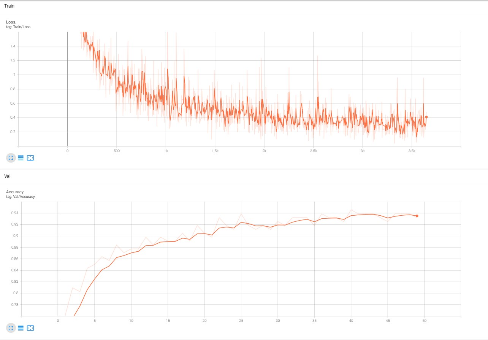

<p align="center">
 <h1 align="center">Flower-Image-Classication</h1>
</p>


## Introduction
This project focuses on training a Convolutional Neural Network (CNN) model using the PyTorch framework to classifying of 10 different types of flowers. The model is based on the pretrained ResNet50 architecture fine-tuned on a flower dataset and aims to achieve high accuracy in flower classification.


## Data
Data used for this project consists of images of 10 different types of flowers. You can find it at <a href="https://www.kaggle.com/datasets/aksha05/flower-image-dataset">this link</a>.

### Categories
|||
|-----------|:-----------:|
|Tulips|Gardenias|
|Orchids|Garden Roses|
|Peonies|Daisies|
|Hydrangeas|Hibiscus|
|Lilies|Bougainvillea|

I have processed that data so that it can be used for model training in **dataset.py**.

## Model
The model architecture is defined in the **models.py** file. It uses a pretrained ResNet-50 backbone with the final fully connected layer replaced to match the number of flower classes.

## Training
You can train the model by running the following command:
```
python train.py -r path/to/flower/dataset
```
Replace path/to/flower/dataset with the path to your flower dataset.

You can specify additional training parameters such as the number of epochs, batch size, and image size, ...

After each epoch, the best model and the last model and will be saved in the **trained_models**.

If you pause the training process, you can resume it from the previous checkpoint by running the following command:

```
python train.py -c trained_models/last_model.pt
```

## Trained Models
You can find trained models I have trained in <a href="https://drive.google.com/drive/folders/1TE0VXANKqDsXVlNqw-nPuqGA4zvLu-3-?usp=sharing">this link</a>

## Experiments
I trained the model for 50 epochs and the best model of arccuracy is **0.9455782312925171**.

Loss/iteration during training & Accuracy/epoch during validation


## Testing
You can test the model with images in **test_image** by running the following command:
```
python test.py -p path/to/test/image -c trained_models/best_model.pt
```
Replace path/to/test/image with the path to your test image.
### Result


&nbsp;&nbsp;&nbsp;

Bougainvillea is predicted class and 99.93% is confidence score

## Requirements
- Python 
- PyTorch
- scikit-learn
- PIL or cv2
- tensorboard
