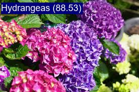
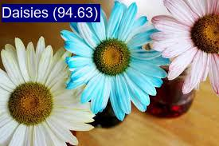

<p align="center">
 <h1 align="center">Flower-Image-Classication</h1>
</p>


## Introduction
This project is an implementation of a simple Convolutional Neural Network (CNN) for classifying 10 different types of flowers.

It uses PyTorch for the deep learning framework and a publicly available dataset of flower images.





## Data
Data used for this project consists of images of 10 different types of flowers. You can find it at <a href="https://www.kaggle.com/datasets/aksha05/flower-image-dataset">this link</a>

### Categories
|||
|-----------|:-----------:|
|Tulips|Gardenias|
|Orchids|Garden Roses|
|Peonies|Daisies|
|Hydrangeas|Hibiscus|
|Lilies|Bougainvillea|

I have processed that data so that it can be used for model training in **dataset.py**

## Model
We use a simple CNN architecture for image classification. The model architecture is defined in the **models.py** file.

## Training
You can train the model by running the following command:
```
python train.py -r path/to/flower/dataset
```
Replace path/to/flower/dataset with the path to your flower dataset. The script supports various arguments for customization, such as batch size, number of epochs, image size, and more.

After training, the model's accuracy on the test set will be displayed, and the best model (**best_model.pt**) will be saved in the **trained_models** directory.

## Trained Models
You can find trained models I have trained in <a href="https://drive.google.com/drive/folders/12zUspjpC2t8SNh4J9NLfrtcVFPCkItJm?usp=sharing">this link</a>

## Experiments
I trained the model for 100 epochs and the best model of arccuracy is 0.8027210884353742

Loss/iteration in training & Accuracy/epoch in validation


## Testing
You can test the model by running the following command:
```
python test.py -p path/to/test/image
```
Replace path/to/test/image with the path to your test image.

        


## Requirements
- Python 
- PyTorch
- torchvision
- scikit-learn
- tqdm
- OpenCV
